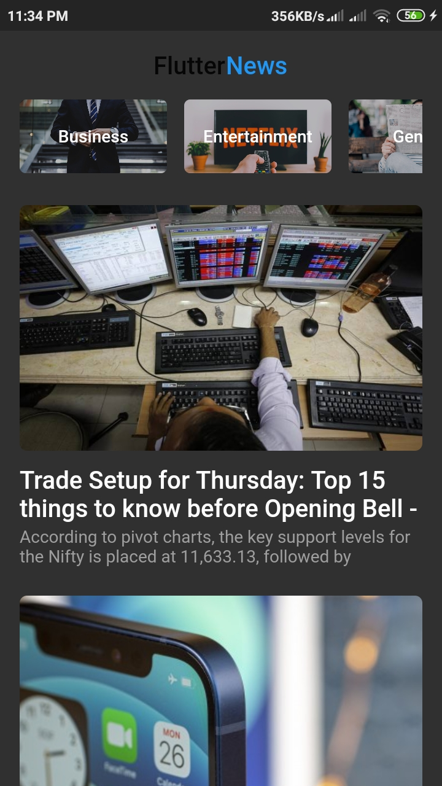
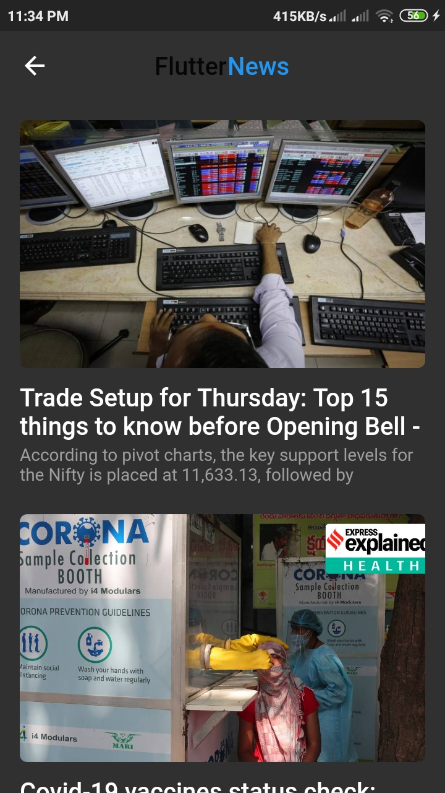

# flutter_news_app_api

### Hi there, I'm Animesh Banerjee 👋

- 💪 I’m currently learning everything
- 👯 I’m always looking for new project ideas
- 🥅 2020 Goals: Contribute more to Open Source projects
- ⚡ Fun fact: I love to draw and play video games and spending time with family

### Connect with me:

[][facebook]
[][linkedin]
[][instagram]

 
---

### Used Languages and Tools:

[][github]
[[github]
[][github]
[][github]
[][github]

 

### Used Flutter Packages

>[http: ^0.12.2](https://pub.dev/packages/http)

>[cached_network_image: ^2.3.3](https://pub.dev/packages/cached_network_image)

>[webview_flutter: ^1.0.5](https://pub.dev/packages/webview_flutter)

>[shared_preferences: ^0.5.12+2](https://pub.dev/packages/shared_preference)

### News API Source
[For News API tap here !](https://newsapi.org/)

---

### Snapshots of the above Project
_Main Page_
 
 

 
 
 
 

_Inside category item Page_
 
 

 
 
 
 

***
### Personal Details
_Email_ : **animeshece1998@gmail.com**
 
_Contact No_ : **9475382132**

***
***
**Keep smiling and work harder**

##_**Thank You for visiting me**_

[instagram]: https://www.instagram.com/animesh_rik_banerjee/?hl=en
[linkedin]: https://www.linkedin.com/in/animesh-banerjee-747012137/
[facebook]: https://www.facebook.com/animesh.banerjee.3979489
[github]: https://github.com/animeshrick

